# گزارش آزمایش سوم مهندسی نرم‌افزار

## توسعهٔ آزمون‌محور سبد خرید (TDD Shopping Cart)

این مخزن نتیجهٔ آزمایش «مفاهیمی در آزمون نرم‌افزار» است. در این آزمایش، پروژهٔ پایهٔ `ShoppingCart` ابتدا اجرا و تحلیل شد؛ سپس با چرخهٔ **Red – Green – Refactor**، باگ‌های قابل مشاهده اصلاح شدند، قابلیت `updateItemPrice` و محدودیت مبلغ نهایی خرید توسعه یافتند، و کیفیت آزمون‌ها با **JaCoCo** و **PIT Mutation Testing** ارزیابی شد.

> این README با الهام از ساختار گزارش مرجعِ معرفی‌شده در صورت‌کار تنظیم شده، اما متن، سناریوها، نتایج، تصاویر و تصمیم‌های آن مختص همین مخزن هستند.

## ۱. پیش‌نیازها و اجرای پروژه

- JDK 17
- Maven 3.x
- IntelliJ IDEA (برای اجرای تعاملی تست‌ها؛ اختیاری)

برای اجرای تمام تست‌ها و ساخت گزارش JaCoCo:

```bash
mvn clean test
```

گزارش HTML JaCoCo پس از اجرا در مسیر زیر ساخته می‌شود:

```text
target/site/jacoco/index.html
```

برای اجرای Mutation Testing با PIT:

```bash
mvn test-compile org.pitest:pitest-maven:mutationCoverage
```

گزارش HTML PIT در مسیر زیر ساخته می‌شود:

```text
target/pit-reports/index.html
```

پیکربندی `pom.xml` عمداً ساختار غیرمتعارف پروژهٔ پایه را پشتیبانی می‌کند: `src` به‌عنوان source directory و `Test` به‌عنوان test source directory معرفی شده‌اند. PIT نیز فقط کلاس هدف `ShoppingCart` را تحلیل می‌کند.

## ۲. مدل و قراردادهای نهایی

کلاس اصلی یک `Map<String, Double>` از نام کالا به قیمت نگه می‌دارد. رفتارهای مهم آن در نسخهٔ نهایی چنین‌اند:

| عملیات | قرارداد قابل مشاهده |
|---|---|
| `addItem(name, price)` | کالا را اضافه می‌کند؛ نام تکراری قیمت قبلی را جایگزین می‌کند. |
| `removeItem(name)` | در صورت وجود کالا آن را حذف و `true` برمی‌گرداند؛ برای نام ناموجود `false` و بدون تغییر state برمی‌گرداند. |
| `getTotal()` | مجموع قیمت‌ها را با `BigDecimal` و گرد کردن `HALF_UP` تا دو رقم اعشار حساب می‌کند. |
| `getTotalWithDiscount()` | برای مجموع حداقل ۱۰۰، تخفیف ۱۰٪ را اعمال و نتیجه را تا دو رقم اعشار گرد می‌کند. |
| `updateItemPrice(name, price)` | قیمت کالای موجود را تغییر می‌دهد؛ نام null/blank و قیمت نامعتبر را رد می‌کند؛ برای کالای ناموجود no-op است. |
| `validateCheckout()` | مجموع پایهٔ سبد را پیش از تخفیف کنترل می‌کند: حداقل `50.00` و حداکثر `10000.00`، هر دو شامل مرزها. |

**توضیح مرز تخفیف:** در نسخهٔ پایه بین متن صورت‌مسئله و انتظار تست اولیه دربارهٔ مجموع دقیقاً ۱۰۰ تعارض وجود داشت. طبق تصمیم تأییدشدهٔ دستیار درس، قرارداد این مخزن `total >= 100` است؛ بنابراین مجموع `100.00` به `90.00` تبدیل می‌شود. این تصمیم در تست مرزی ثبت شده است.

## ۳. تحلیل اولیه (Baseline)

در شروع آزمایش، چهار تست موجود اجرا شدند و همگی پاس شدند. با این حال، تست‌های پایه همهٔ مسیرهای رفتاری و لبه‌های عددی را پوشش نمی‌دادند؛ بنابراین سبزبودن آن‌ها به‌تنهایی نشانهٔ صحت کامل سبد نبود.

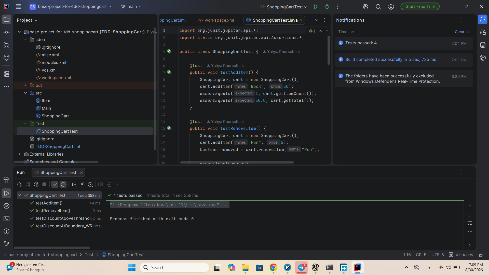

## ۴. چرخه‌های TDD انجام‌شده

### ۴.۱ دقت اعشاریِ مجموع

جمع‌کردن مستقیم `double` می‌تواند خطای نمایش و مقایسهٔ اعشاری ایجاد کند. ابتدا تستی برای مجموع قیمت‌های اعشاری نوشته شد و در مرحلهٔ Red شکست خورد:

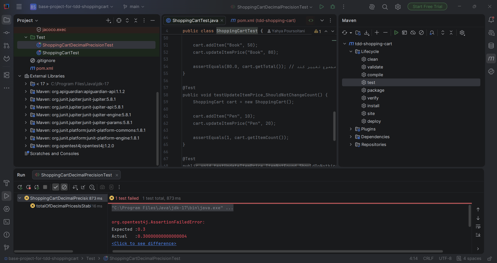

در مرحلهٔ Green، محاسبه به `BigDecimal.valueOf` منتقل و خروجی با `HALF_UP` تا دو رقم اعشار گرد شد. نتیجه، مجموع‌های مالی پایدار و قابل آزمون است.

### ۴.۲ گردکردن مبلغ پس از تخفیف

تست بعدی نشان داد اعمال تخفیف نیز باید به‌صورت مالی و با دو رقم اعشار گرد شود، نه با خروجی خام ممیز شناور.

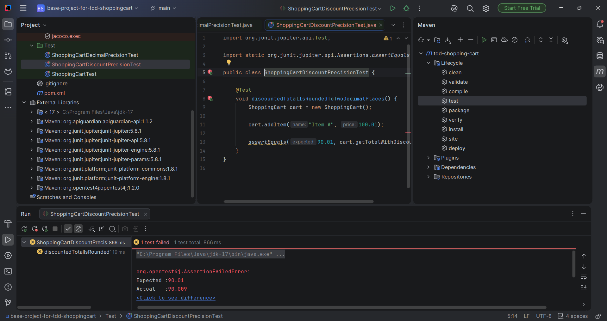

پس از اصلاح، مبلغ کل ابتدا به `BigDecimal` تبدیل و سپس در `0.9` ضرب و با `HALF_UP` گرد می‌شود.

### ۴.۳ مرز تخفیف

یک تست مرزی مخصوص مجموع دقیقاً `100.00` نوشته شد تا تفاوت بین `>` و `>=` دیده شود.

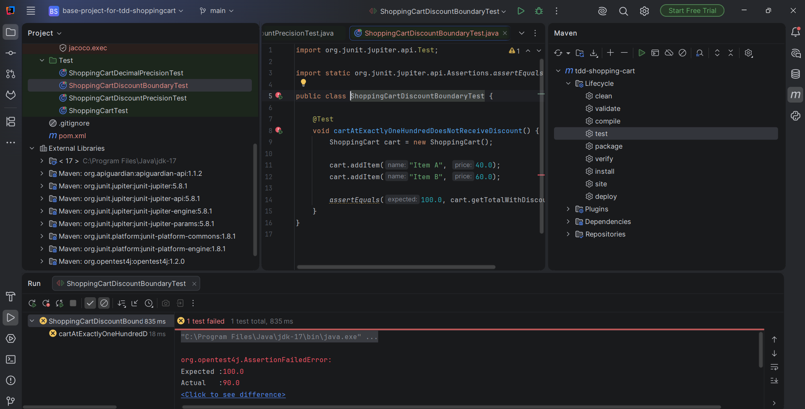

طبق تصمیم ثبت‌شدهٔ بخش ۲، رفتار نهایی برای این مرز اعمال تخفیف است. مهم‌ترین نکتهٔ این مرحله آن است که مقادیر میانی مثل ۱۲۰ نمی‌توانند خطای operator در مرز ۱۰۰ را کشف کنند.

### ۴.۴ تغییر قیمت کالا (`updateItemPrice`)

برای این متد سناریوهای زیر آزمایش شدند:

- تغییر موفق قیمت بدون تغییر تعداد کالاها؛
- تغییر مجموع و اثر آن بر تخفیف؛
- پشتیبانی از قیمت اعشاری؛
- رد قیمت صفر، منفی، `NaN` و بی‌نهایت؛
- رد نام `null` و blank؛
- no-op بودن درخواست تغییر قیمت برای کالای ناموجود.

پیاده‌سازی در ابتدا نام و قیمت را اعتبارسنجی می‌کند. سپس فقط در صورت وجود نام در `Map` مقدار را جایگزین می‌نماید؛ بنابراین درخواست برای کالای ناموجود نه exception می‌دهد و نه وضعیت سبد را تغییر می‌دهد.

### ۴.۵ قابلیت تجاری: کف و سقف مبلغ خرید

قابلیت دوم با متد `validateCheckout()` افزوده شد. این متد مجموع پایهٔ سبد را کنترل می‌کند، نه مجموع پس از تخفیف:

| مجموع سبد | انتظار |
|---:|---|
| `0.00` | `IllegalStateException` |
| `49.99` | `IllegalStateException` |
| `50.00` | مجاز |
| `10000.00` | مجاز |
| `10000.01` | `IllegalStateException` |

تست‌های خطا علاوه بر exception، ثابت‌ماندن تعداد و مجموع سبد را نیز بررسی می‌کنند؛ چون اعتبارسنجی checkout نباید داده‌های سبد را تغییر دهد.

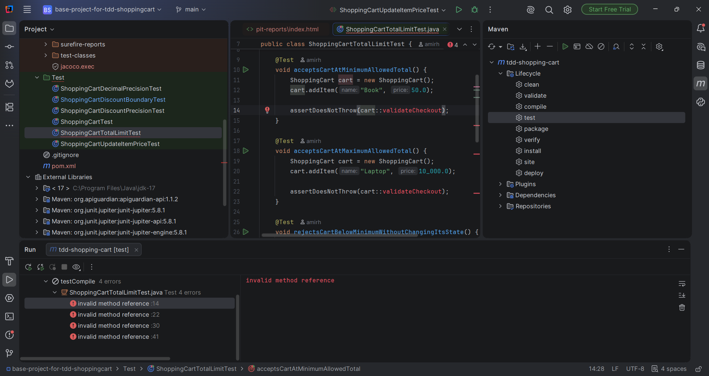

## ۵. تست‌های تکمیلی و پوشش رفتارها

تست‌های افزوده‌شده فقط به مسیرهای موفق محدود نیستند. آن‌ها رفتارهای منفی و مرزی را نیز پوشش می‌دهند:

- حذف کالای ناموجود و بازگشت `false` بدون تغییر سبد؛
- مجموع‌های کمتر از آستانهٔ تخفیف؛
- جایگزینی قیمت هنگام افزودن نام تکراری؛
- حداقل، حداکثر، پایین‌تر و بالاتر از بازهٔ checkout؛
- اعتبارسنجی input در `updateItemPrice`؛
- سناریوهای پارامتریک برای چند ورودی هم‌خانواده.

در آخرین اجرای ثبت‌شده، هر ۳۶ تست با موفقیت گذشتند:

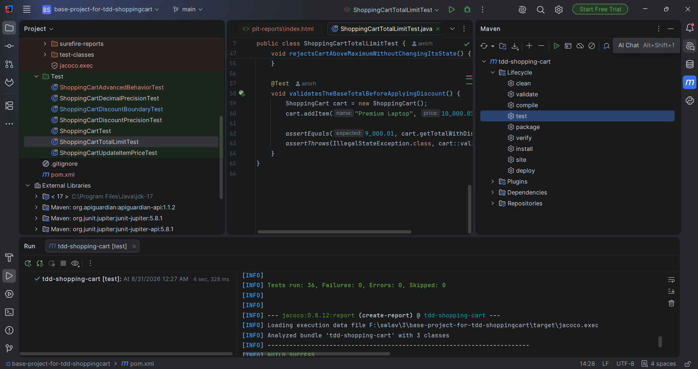

## ۶. گزارش JaCoCo

JaCoCo نشان می‌دهد چه خطوط، branchها و متدهایی واقعاً در اجرای تست‌ها اجرا شده‌اند. نتایج نهایی برای **کلاس هدف `ShoppingCart`** چنین است:

| معیار | نتیجه |
|---|---:|
| Line Coverage | 36/36 — 100٪ |
| Branch Coverage | 20/20 — 100٪ |
| Method Coverage | 9/9 — 100٪ |
| Instruction Coverage | 150/150 — 100٪ |

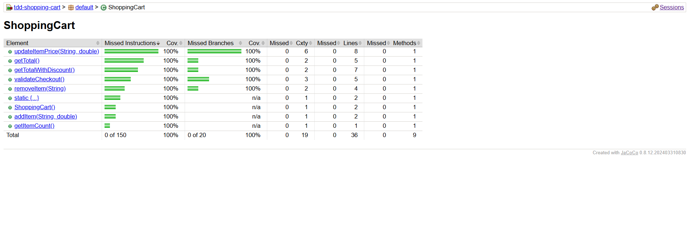

تصویر گزارش کلی نیز نگهداری شده است:

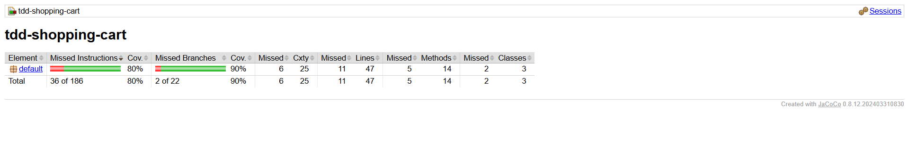

عدد ۱۰۰٪ در این گزارش مختص `ShoppingCart` است. کلاس‌های `Item` و `Main` تست مستقیم ندارند؛ پس درصد کلی bundle از ۱۰۰٪ پایین‌تر است. این تفکیک از برداشت نادرست دربارهٔ scope گزارش جلوگیری می‌کند.

## ۷. Mutation Testing با PIT

JaCoCo فقط اجرای کد را می‌سنجد. PIT عمداً تغییرات کوچک و خطادار (mutant) در کد ایجاد می‌کند و بررسی می‌کند تست‌ها آن تغییر را تشخیص می‌دهند یا خیر. برای مثال، PIT می‌تواند operator یک شرط، مقدار بازگشتی یا عملگر محاسباتی را تغییر دهد.

در اجرای اولیه، موارد `NO_COVERAGE` نشان دادند دو رفتار هنوز تست نشده‌اند: حذف کالای ناموجود و مجموع پایین‌تر از آستانهٔ تخفیف. پس از افزودن تست‌های رفتاری مربوط، گزارش نهایی PIT چنین شد:

| معیار PIT برای `ShoppingCart` | نتیجه |
|---|---:|
| Line Coverage | 36/36 — 100٪ |
| Mutation Coverage | 19/19 — 100٪ |
| Test Strength | 19/19 — 100٪ |

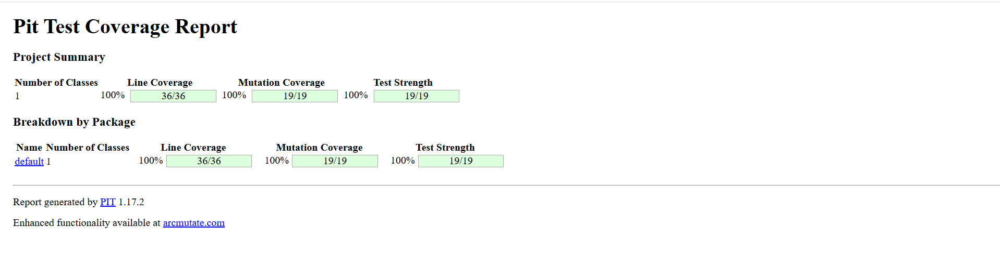

تصاویر اجرای اولیه و میانی PIT نیز برای نشان‌دادن روند تحلیل حفظ شده‌اند:

| JaCoCo اولیه | PIT اولیه | PIT میانی |
|---|---|---|
| 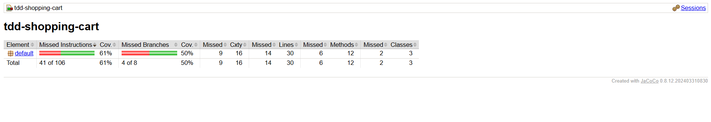 | 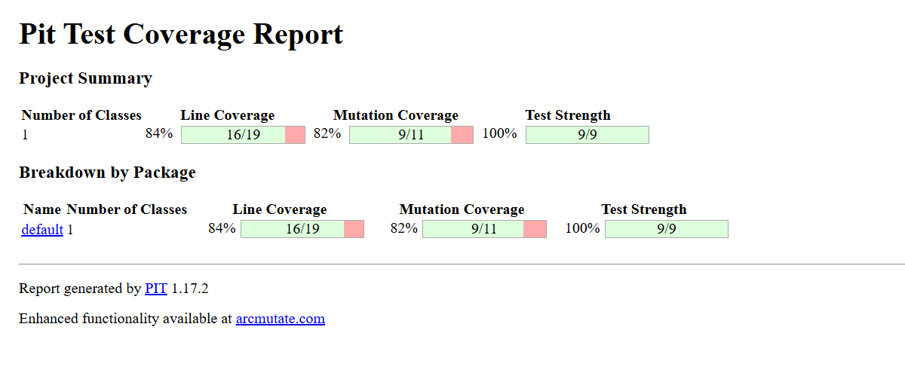 | 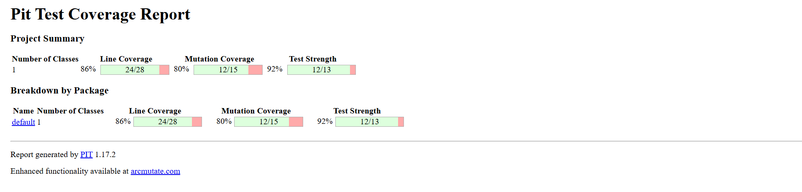 |

پوشش یا mutation score صددرصد به‌تنهایی اثبات کامل‌بودن نیازمندی‌ها نیست؛ فقط نشان می‌دهد برای قراردادهای آزموده‌شده، مسیرها اجرا و mutationهای تولیدشده کشته شده‌اند.

## ۸. ساختار تست‌ها

```text
Test/
├── ShoppingCartTest.java
├── ShoppingCartDecimalPrecisionTest.java
├── ShoppingCartDiscountPrecisionTest.java
├── ShoppingCartDiscountBoundaryTest.java
├── ShoppingCartUpdateItemPriceTest.java
├── ShoppingCartTotalLimitTest.java
└── ShoppingCartAdvancedBehaviorTest.java
```

## ۹. شواهد تصویری

همهٔ تصاویر از اجرای واقعی پروژه نگهداری شده‌اند:

| شماره | مدرک |
|---:|---|
| ۱ | اجرای baseline |
| ۲ | Red برای دقت مجموع اعشاری |
| ۳ | Red برای گردکردن تخفیف |
| ۴ | Red برای مرز تخفیف |
| ۵ | JaCoCo اولیه |
| ۶ | PIT اولیه |
| ۷ | PIT میانی |
| ۸ | Red برای قابلیت کف/سقف checkout |
| ۹ | ۳۶ تست پاس |
| ۱۰ | گزارش کلی JaCoCo |
| ۱۱ | پوشش ۱۰۰٪ `ShoppingCart` در JaCoCo |
| ۱۲ | پوشش ۱۰۰٪ در PIT |

## ۱۰. استفادهٔ شفاف از Codex

Codex به‌عنوان ابزار کمکی برای تحلیل کد پایه، پیشنهاد edge caseها، تفسیر خروجی Maven/JaCoCo/PIT، بازبینی تست‌ها و تهیهٔ گزارش به کار رفت. تصمیم‌های نهایی با اجرای واقعی تست‌ها، گزارش ابزارها و تأیید دستیار درس برای مرز تخفیف کنترل شدند.

رونوشت تعامل‌های این جلسه در فایل زیر موجود است:

- [codex-session-interactions.md](codex-session-interactions.md)
